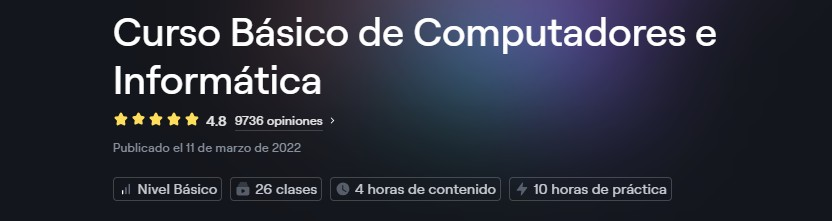

#  🎓 Curso Básico de Computadores e Informática

   

  👉🏻 [Ve al curso: Básico de Computadores e Informática](https://platzi.com/cursos/computacion-basica)
  
   

  | Nombre del profesor | Perfil profesional | Fecha publicación del Curso |
  | :--- | :--- | :--- |
  | Profesor: **Ricardo Celis** | Google developer   🖥️ Chief Technology Officer at Besage.ai   Experto en Javascript y web Components | 📅 Publicado el 11 de marzo de 2022 |
  
   

> Explora la evolución y el funcionamiento de Internet. Comprende su historia, el papel crucial de los protocolos, cómo se comunican las computadoras y su impacto en la web moderna. Ideal para quienes desean entender el corazón tecnológico de la web desde sus cimientos.

---

## Clases del curso
