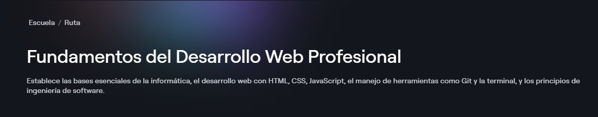

# 💻 Escuela de Desarrollo Web

Este es el índice de las rutas y cursos que he tomado en la [Escuela de Desarrollo Web](https://platzi.com/escuela/web) que Contiene **16 rutas**

---

## 1. 🧱 Fundamentos del Desarrollo Web Profesional

👉🏻 [Ruta de Platzi](https://platzi.com/ruta/intro-desarrollo-web)

> Esta ruta establece las bases esenciales de la informática, el desarrollo web con HTML, CSS, JavaScript, el manejo de herramientas como Git y la terminal, y los principios de ingeniería de software.

### Cursos de la ruta:

| Nombre del curso | Estado | Progreso | Mis Notas |
| :--- | :--- | :--- | :--- |
| **Curso de Introducción a la Web: Historia y Funcionamiento de Internet** | 🎓 Curso Aprobado!✅ | 100% 🔋 | [Notas del curso](./01-fundamentos-dwp/1-a-introduccion-web.md.md) |
| **Curso Básico de Computadores e Informática** | 🎓 Curso Aprobado!✅ | 100% 🔋 | [Notas del curso](./01-fundamentos-dwp/1-b-computadoras-informatica.md) |
| **Curso de Introducción a la Terminal y Línea de Comandos** | 🎓 Curso Aprobado!✅ | 100% 🔋 | [Notas del curso](./01-fundamentos-dwp/1-c-terminal.md) |
| **Curso de Fundamentos de Ingeniería de Software** | 🎓 Curso Aprobado!✅ | 100% 🔋 | [Notas del curso](./01-fundamentos-dwp/1-d-ing-software.md) |
| **Curso de HTML** | ⏳ Completar contenido | 60% | [Notas del curso](./01-fundamentos-dwp/1-e-html-2025.md) |
| **Curso de CSS** | 🎓 Curso Aprobado!✅ | 100% 🔋 | [Notas del curso](./01-fundamentos-dwp/1-f-css-2025.md) |
| **Curso Práctico de HTML y CSS** | 🎓 Curso Aprobado!✅ | 100% 🔋 | [Notas del curso](./01-fundamentos-dwp/1-g-html-css-practico.md) |
| **Curso Gratis de Programación Básica** | ⏳ Completar contenido | 30% | [Ir a las Notas](./01-fundamentos-dwp/1-h-programacion-basica.md) |
| **Curso de Fundamentos de JavaScript** | ✅ Completado | 100% | [Ir a las Notas](./01-fundamentos-dwp/1-i-fund-js.md) |
| **Curso de Git y GitHub** | 🎓 Curso Aprobado!✅ | 100% 🔋 | [Ir a las Notas](./01-fundamentos-dwp/1-j-git-github.md) |

---

## 2. ⚙️📐 Diseño y Desarrollo Frontend
👉🏻 [Ruta de Platzi](https://platzi.com/ruta/diseno-desarrollo-frontend)
### Cursos de la ruta:

| Nombre del curso | Estado | Progreso | Notas |
| :--- | :--- | :--- | :--- |
| **Curso de Frontend Developer** | ✅ Completado | 100% | [Ir a las Notas](./Ruta-Frontend/Curso-de-JavaScript-Básico/README.md) |
| **Curso Práctico de Frontend Developer** | ✅ Completado | 100% | [Ir a las Notas](./Ruta-Frontend/Curso-de-JavaScript-Básico/README.md) |
| **Curso de CSS** | ✅ Completado | 100% | [Ir a las Notas](./Ruta-Frontend/Curso-de-JavaScript-Básico/README.md) |
| **Curso de Responsive Design: Maquetación Mobile First** | ✅ Completado | 100% | [Ir a las Notas](./Ruta-Frontend/Curso-de-JavaScript-Básico/README.md) |
| **Curso Práctico de Maquetación en CSS** | ✅ Completado | 100% | [Ir a las Notas](./Ruta-Frontend/Curso-de-JavaScript-Básico/README.md) |
| **Curso de Diseño Web con CSS Grid y Flexbox** | ✅ Completado | 100% | [Ir a las Notas](./Ruta-Frontend/Curso-de-JavaScript-Básico/README.md) |
| **Curso de CSS Grid Básico** | ✅ Completado | 100% | [Ir a las Notas](./Ruta-Frontend/Curso-de-JavaScript-Básico/README.md) |
| **Curso Profesional de CSS Grid Layout** | ✅ Completado | 100% | [Ir a las Notas](./Ruta-Frontend/Curso-de-JavaScript-Básico/README.md) |
| **Curso de Transformaciones y Transiciones en CSS** | ✅ Completado | 100% | [Ir a las Notas](./Ruta-Frontend/Curso-de-JavaScript-Básico/README.md) |
| **Curso de Animaciones con CSS** | ✅ Completado | 100% | [Ir a las Notas](./Ruta-Frontend/Curso-de-JavaScript-Básico/README.md) |
| **Curso de Fundamentos de Sass: Crea tu Primera Landing Page** | ✅ Completado | 100% | [Ir a las Notas](./Ruta-Frontend/Curso-de-JavaScript-Básico/README.md) |
| **Curso de TailwindCSS** | ✅ Completado | 100% | [Ir a las Notas](./Ruta-Frontend/Curso-de-JavaScript-Básico/README.md) |
| **Curso de Arquitecturas CSS** | ✅ Completado | 100% | [Ir a las Notas](./Ruta-Frontend/Curso-de-JavaScript-Básico/README.md) |
| **Curso Práctico de Maquetación y Animaciones con CSS** | ✅ Completado | 100% | [Ir a las Notas](./Ruta-Frontend/Curso-de-JavaScript-Básico/README.md) |
| **Curso de Materialize** | ✅ Completado | 100% | [Ir a las Notas](./Ruta-Frontend/Curso-de-JavaScript-Básico/README.md) |

---

## 3. ⚙️ Desarrollo Frontend con JavaScript
👉🏻 [Ruta de Platzi](https://platzi.com/ruta/desarollo-frontend-con-javascript)
### Cursos de la ruta:

| Nombre del curso | Estado | Progreso | Notas |
| :--- | :--- | :--- | :--- |
| **Curso de JavaScript: Manipulación del DOM** | ✅ Completado | 100% | [Ir a las Notas](./Ruta-Frontend/Curso-de-JavaScript-Básico/README.md) |
| **Curso de ECMAScript: Historia y Versiones de JavaScript** | ✅ Completado | 100% | [Ir a las Notas](./Ruta-Frontend/Curso-de-JavaScript-Básico/README.md) |
| **Curso de NPM: Gestión de Paquetes y Dependencias en JavaScript** | ✅ Completado | 100% | [Ir a las Notas](./Ruta-Frontend/Curso-de-JavaScript-Básico/README.md) |
| **Curso de Introducción a Empaquetadores Web** | ✅ Completado | 100% | [Ir a las Notas](./Ruta-Frontend/Curso-de-JavaScript-Básico/README.md) |
| **Curso de Webpack** | ✅ Completado | 100% | [Ir a las Notas](./Ruta-Frontend/Curso-de-JavaScript-Básico/README.md) |
| **Curso de JavaScript: Web Components** | ✅ Completado | 100% | [Ir a las Notas](./Ruta-Frontend/Curso-de-JavaScript-Básico/README.md) |
| **Curso de Single Page Application con JavaScript Vanilla** | ✅ Completado | 100% | [Ir a las Notas](./Ruta-Frontend/Curso-de-JavaScript-Básico/README.md) |
| **Curso de Debugging con Chrome DevTools** | ✅ Completado | 100% | [Ir a las Notas](./Ruta-Frontend/Curso-de-JavaScript-Básico/README.md) |
| **Curso de Optimización Web** | ✅ Completado | 100% | [Ir a las Notas](./Ruta-Frontend/Curso-de-JavaScript-Básico/README.md) |
| **Curso de Vite.js** | ✅ Completado | 100% | [Ir a las Notas](./Ruta-Frontend/Curso-de-JavaScript-Básico/README.md) |
| **Curso de SolidJS** | ✅ Completado | 100% | [Ir a las Notas](./Ruta-Frontend/Curso-de-JavaScript-Básico/README.md) |
| **Curso de Svelte** | ✅ Completado | 100% | [Ir a las Notas](./Ruta-Frontend/Curso-de-JavaScript-Básico/README.md) |

---

## 6. ⚙️ Desarrollo Frontend con React.js
👉🏻 [Ruta de Platzi](https://platzi.com/ruta/desarrollo-frontend-react-js)
### Cursos de la ruta:

| Nombre del curso | Estado | Progreso | Notas |
| :--- | :--- | :--- | :--- |
| **Curso de React.js** | ✅ Completado | 100% | [Ir a las Notas](./Ruta-Frontend/Curso-de-JavaScript-Básico/README.md) |
| **Curso de React.js: Manejo Profesional del Estado** | ✅ Completado | 100% | [Ir a las Notas](./Ruta-Frontend/Curso-de-JavaScript-Básico/README.md) |
| **Curso de React.js: Patrones de Render y Composición** | ✅ Completado | 100% | [Ir a las Notas](./Ruta-Frontend/Curso-de-JavaScript-Básico/README.md) |
| **Curso de React.js: Navegación con React Router** | ✅ Completado | 100% | [Ir a las Notas](./Ruta-Frontend/Curso-de-JavaScript-Básico/README.md) |
| **Curso Profesional de React.js y Redux** | ✅ Completado | 100% | [Ir a las Notas](./Ruta-Frontend/Curso-de-JavaScript-Básico/README.md) |
| **Curso de Server Side Render o SSR con React.js** | ✅ Completado | 100% | [Ir a las Notas](./Ruta-Frontend/Curso-de-JavaScript-Básico/README.md) |
| **Curso de React Avanzado** | ✅ Completado | 100% | [Ir a las Notas](./Ruta-Frontend/Curso-de-JavaScript-Básico/README.md) |
| **Curso de React.js con TypeScript** | ✅ Completado | 100% | [Ir a las Notas](./Ruta-Frontend/Curso-de-JavaScript-Básico/README.md) |

---